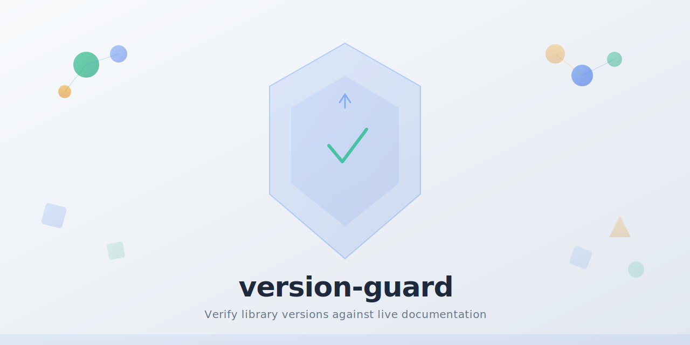
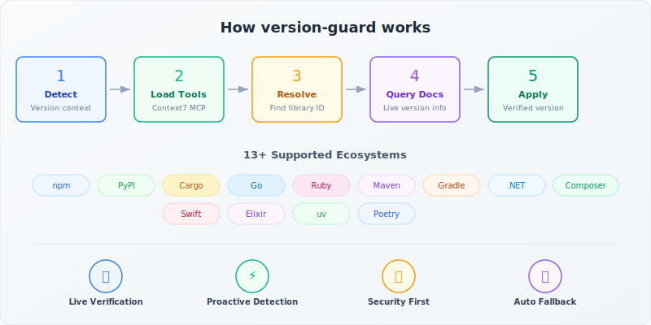

# version-guard

[](LICENSE)
[](https://docs.anthropic.com/en/docs/claude-code)
[](https://github.com/zircote/version-guard)
[](https://context7.com)

<picture>
  <source media="(prefers-color-scheme: dark)" srcset=".github/social-preview-dark.svg">
  <source media="(prefers-color-scheme: light)" srcset=".github/social-preview.svg">
  
</picture>

A [Claude Code](https://docs.anthropic.com/en/docs/claude-code) plugin that verifies and enforces use of the latest stable library and package versions using live documentation lookups.

## Problem

Claude's training data has a knowledge cutoff. When recommending library versions, install commands, or dependency configurations, it may suggest outdated versions — leading to:

- **Security vulnerabilities** from known-vulnerable older releases
- **Wasted migration effort** when users install old versions and immediately need to upgrade
- **Deprecated API usage** from code examples targeting superseded releases
- **Poor developer experience** from outdated patterns and missing features

## Solution

version-guard intercepts version-sensitive contexts and verifies the current stable release against live documentation via the [Context7](https://context7.com) MCP server before making any recommendation. It works across 13+ package ecosystems.

## Supported Ecosystems

| Ecosystem | Dependency Files |
|-----------|-----------------|
| Node/npm | `package.json`, `package-lock.json` |
| Python/pip | `requirements.txt`, `pyproject.toml`, `setup.py`, `Pipfile` |
| Python/uv | `pyproject.toml`, `uv.lock` |
| Python/poetry | `pyproject.toml`, `poetry.lock` |
| Rust/cargo | `Cargo.toml`, `Cargo.lock` |
| Go | `go.mod`, `go.sum` |
| Ruby | `Gemfile`, `Gemfile.lock`, `*.gemspec` |
| Java/Maven | `pom.xml` |
| Java/Gradle | `build.gradle`, `build.gradle.kts` |
| .NET | `*.csproj`, `packages.config` |
| PHP/Composer | `composer.json`, `composer.lock` |
| Swift | `Package.swift` |
| Elixir | `mix.exs` |

## Installation

### From a Plugin Marketplace

```bash
claude plugin install version-guard@<marketplace-name>
```

### From Local Path

Clone the repository and install from the local directory:

```bash
git clone https://github.com/zircote/version-guard.git
claude plugin install --local /path/to/version-guard
```

### From GitHub

```bash
claude plugin install --git https://github.com/zircote/version-guard.git
```

## Requirements

- **Claude Code** CLI
- **Context7 MCP server** — The plugin uses Context7 for live documentation lookups. Configure it in your Claude Code MCP settings:

```json
{
  "mcpServers": {
    "context7": {
      "command": "npx",
      "args": ["-y", "@context7/mcp"]
    }
  }
}
```

- **Network access** — Required to query Context7 and (as a fallback) web search for version info

## Usage

### Explicit Invocation

```
/version-guard
```

Then describe the library or dependency you need to verify. For example:

```
/version-guard What is the latest version of React?
```

### Proactive Activation

The plugin activates automatically when Claude detects version-sensitive contexts:

- Recommending or selecting a library version
- Adding dependencies to a project
- Writing install commands (`npm install`, `pip install`, `cargo add`, etc.)
- Writing code examples with version-sensitive imports
- Responding to "what version of X should I use?" questions
- Upgrading or auditing existing dependencies

### Example Output

When the plugin verifies a version, you'll see output like:

> Using React v19.1.0 (verified current — training data may reference v18.x)

If a breaking change is detected:

> React 19 removed legacy context API (`contextType`). Use `createContext` + `useContext` instead. See migration guide: https://react.dev/blog/2024/04/25/react-19-upgrade-guide

## How It Works

1. **Detects** version-sensitive context in the conversation
2. **Loads** Context7 MCP tools (deferred tools, loaded on demand)
3. **Resolves** the library via `mcp__context7__resolve-library-id`
4. **Queries** current documentation via `mcp__context7__query-docs`
5. **Applies** the verified version to recommendations and install commands
6. **Flags** breaking changes and deprecated patterns when upgrading

<p align="center">
  
</p>

### Fallback

If Context7 cannot resolve a library, version-guard falls back to:
1. Web search for the latest release
2. GitHub releases page or package registry
3. Clearly states the source of version information

## Plugin Structure

```
version-guard/
├── .claude-plugin/
│   └── plugin.json              # Plugin manifest
├── commands/
│   └── version-guard.md         # User-invocable /version-guard command
├── skills/
│   └── version-guard/
│       └── SKILL.md             # Proactive skill definition
├── references/
│   └── ecosystem-patterns.md    # Ecosystem detection and naming patterns
├── LICENSE
└── README.md
```

## Configuration

No additional configuration is needed beyond the Context7 MCP server. The plugin works out of the box once installed and Context7 is available.

## License

MIT License. See [LICENSE](LICENSE) for details.
